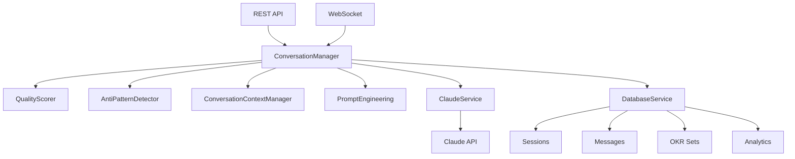

# OKR AI Agent - Technical Implementation Summary

**Project**: OKR AI Agent - Phase 2 Conversation Engine
**Last Updated**: January 29, 2025
**Implementation Phase**: Phase 2 (83% Complete)

## 🏗️ Architecture Overview

### Core System Components



### Service Layer Architecture

**ConversationManager** (Main Engine)
- 8-step message processing pipeline
- Phase transition management
- Strategy determination and intervention application
- Session state management

**QualityScorer**
- 5-dimension objective scoring (weighted)
- 5-dimension key result scoring (weighted)
- Overall quality calculation
- Feedback generation

**AntiPatternDetector**
- 6 pattern types detection
- 3 reframing techniques
- Contextual confidence scoring
- Integration with conversation flow

**ConversationContextManager**
- User profiling and behavior tracking
- Conversation memory management
- Context building and analysis
- Session restoration capabilities

**PromptEngineering**
- Phase-specific prompt templates
- Dynamic context-aware construction
- Token usage optimization
- Claude API integration

**ClaudeService**
- Enhanced API integration
- Engineered prompt support
- Intelligent caching
- Error recovery and rate limiting

## 📊 Data Models

### Core Interfaces

```typescript
interface ConversationSession {
  id: string;
  userId: string;
  phase: ConversationPhase;
  context: UserContext;
  messages: ConversationMessage[];
  objectiveDraft: ObjectiveDraft | null;
  keyResultsDrafts: KeyResultDraft[];
  qualityHistory: QualityScore[];
  metadata: SessionMetadata;
  createdAt: Date;
  updatedAt: Date;
}

interface QualityScores {
  overall?: OverallScore;
  objective?: ObjectiveScore;
  keyResults?: KeyResultScore[];
}

interface ObjectiveScore {
  overall: number; // 0-100
  dimensions: {
    outcomeOrientation: number; // weight 30%
    inspiration: number; // weight 20%
    clarity: number; // weight 15%
    alignment: number; // weight 15%
    ambition: number; // weight 20%
  };
  feedback: string[];
  improvements: string[];
}

interface EngineeredPrompt {
  systemMessage: string;
  userMessage: string;
  contextSummary: string;
  constraints: PromptConstraints;
  tokenEstimate: number;
  confidenceScore: number;
  metadata: {
    templateId: string;
    strategy: ConversationStrategy;
    phase: ConversationPhase;
    adaptations: string[];
    sessionId?: string;
    conversationHistory?: Array<{ role: 'user' | 'assistant'; content: string }>;
  };
}
```

### Database Schema Enhancements

**Sessions Table**
- Enhanced metadata with conversation_state
- Phase tracking with transition history
- Context storage for user preferences

**Messages Table**
- Extended metadata with quality scores
- Anti-pattern detection results
- Intervention tracking
- Prompt template information

**OKR Sets Table**
- Quality breakdown with dimensional scores
- Anti-pattern tracking
- Iteration count and improvement history

## 🚀 API Endpoints

### Enhanced Session Management

```http
# Core session operations
POST   /api/sessions                    # Create new session
GET    /api/sessions/:id               # Get session summary
DELETE /api/sessions/:id               # Delete session

# Message processing
POST   /api/sessions/:id/messages      # Basic message processing
POST   /api/sessions/:id/messages/contextual  # Context-aware processing

# Phase management
POST   /api/sessions/:id/transition    # Force phase transition

# Context and memory
GET    /api/sessions/:id/context       # Comprehensive context
GET    /api/sessions/:id/insights      # Conversation insights
GET    /api/sessions/:id/memory        # Learning history
POST   /api/sessions/:id/restore       # Session restoration

# OKR data
GET    /api/sessions/:id/okrs          # Current OKR state
```

### WebSocket Support
- Real-time conversation processing
- Live quality score updates
- Phase transition notifications
- Context-aware message handling

## ⚙️ Configuration

### Environment Variables

```bash
# Claude API Configuration
ANTHROPIC_API_KEY=claude-sonnet-4-20250514
CLAUDE_MODEL=claude-sonnet-4-20250514
CLAUDE_MAX_TOKENS=4000

# Database Configuration
DATABASE_URL=./data/okr_agent.db
DATABASE_TYPE=sqlite

# Server Configuration
PORT=3001
NODE_ENV=development
LOG_LEVEL=info

# Performance Configuration
MAX_CONVERSATION_HISTORY=20
TOKEN_ESTIMATION_BUFFER=0.1
CACHE_TTL=300000
```

### Quality Scoring Thresholds

```yaml
scoring_thresholds:
  excellent: 90-100      # Celebrate and polish
  good: 75-89           # Minor refinements
  acceptable: 60-74      # Targeted improvements
  needs_work: 40-59      # Significant coaching
  poor: 0-39            # Major intervention

intervention_triggers:
  critical: <25         # Major intervention required
  high: 25-49          # Significant coaching needed
  medium: 50-74        # Targeted improvements
  low: 75-89           # Minor refinements
  none: 90+            # Celebrate and polish
```

## 🧠 Conversation Flow

### Phase Progression

```
Discovery → Refinement → KR Discovery → Validation → Completed
    ↓           ↓            ↓            ↓
Quality    Pattern       Strategy     Intervention
Scoring    Detection     Selection    Application
```

### Message Processing Pipeline

1. **Context Building**: Session state, user history, conversation context
2. **Anti-Pattern Detection**: 6 pattern types with confidence scoring
3. **Quality Assessment**: 5-dimension scoring for objectives and key results
4. **Strategy Determination**: 7 conversation strategies based on context
5. **Intervention Application**: Contextual interventions and reframing
6. **Prompt Engineering**: Dynamic prompt construction with phase templates
7. **Claude Processing**: Enhanced API integration with engineered prompts
8. **Response Generation**: Sophisticated response with quality metadata

### Conversation Strategies

1. **discovery_exploration**: Open-ended exploration for initial understanding
2. **gentle_guidance**: Supportive guidance for hesitant users
3. **direct_coaching**: Clear, direct feedback for experienced users
4. **example_driven**: Learning through concrete examples
5. **question_based**: Socratic method with probing questions
6. **reframing_intensive**: Heavy focus on reframing activity language
7. **validation_focused**: Validation and confirmation of good work

## 🎯 Quality Assurance

### Anti-Pattern Detection

**Core Patterns**:
- `activity_focused`: Task-oriented language instead of outcomes
- `binary_thinking`: Yes/no goals without measurable progress
- `vanity_metrics`: Metrics that don't drive business value
- `business_as_usual`: Status quo maintenance disguised as objectives
- `kitchen_sink`: Overly complex objectives with multiple focuses
- `vague_outcome`: Unclear or unmeasurable outcome statements

**Reframing Techniques**:
- `five_whys`: Deep exploration of underlying motivations
- `outcome_transformation`: Converting activities to outcomes
- `value_exploration`: Understanding business value and impact

### Performance Optimization

**Token Management**:
- Intelligent token estimation with accuracy tracking
- Conversation history truncation (20-message limit)
- Context window optimization for long conversations
- Prompt compression without quality loss

**Caching Strategy**:
- Request-level caching for identical queries
- Prompt-specific caching for engineered prompts
- Session context caching for performance
- Analytics event caching for batch processing

**Memory Management**:
- Efficient conversation history storage
- Context cleanup for completed sessions
- Rate limiter cleanup for expired sessions
- Background cleanup processes

## 🔧 Development Tools

### TypeScript Configuration
- Strict mode enabled
- Comprehensive type definitions
- Interface-driven development
- Error handling at type level

### Build & Development
```bash
npm run dev          # Development server with hot reload
npm run build        # TypeScript compilation
npm run start        # Production server
npm run test         # Test suite execution
npm run lint         # Code quality checks
```

### Database Management
```bash
npm run db:create    # Create database schema
npm run db:migrate   # Run migrations
npm run db:seed      # Seed development data
npm run db:reset     # Reset database
```

## 📈 Monitoring & Analytics

### Logging Strategy
- Structured JSON logging with Winston
- Request/response logging with timing
- Error logging with stack traces
- Performance metrics logging
- User interaction analytics

### Key Metrics Tracked
- Conversation completion rates
- Quality score distributions
- Anti-pattern detection accuracy
- Response time percentiles
- Token usage optimization
- User engagement patterns

### Health Monitoring
```http
GET /health          # Basic health check
GET /health/detailed # Comprehensive system status
GET /metrics         # Prometheus-compatible metrics
```

## 🛡️ Security & Privacy

### Data Protection
- Input sanitization for all user content
- PII detection and handling
- Secure session management
- API key protection

### Rate Limiting
- Per-session rate limiting
- Claude API rate limiting
- Exponential backoff on failures
- Circuit breaker pattern

### Error Handling
- Graceful degradation for service failures
- Comprehensive error classification
- User-friendly error messages
- Automatic retry mechanisms

## 🚀 Deployment

### Production Readiness
- Environment-specific configuration
- Health checks and monitoring
- Graceful shutdown handling
- Process management with PM2

### Scaling Considerations
- Horizontal scaling capability
- Database connection pooling
- Redis session store support
- Load balancer compatibility

---

**Current Status**: Ready for Step 6 (Integration Testing and Optimization)
**Next Priority**: End-to-end testing and performance validation