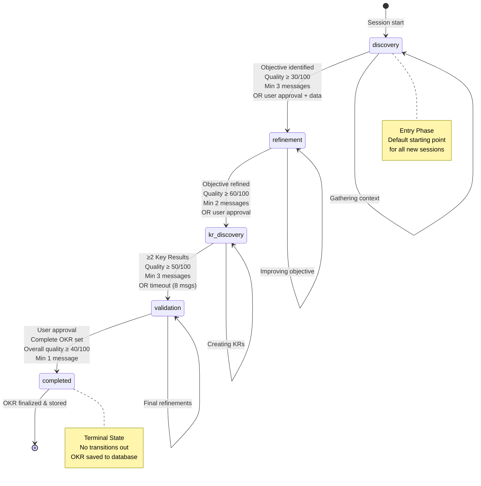
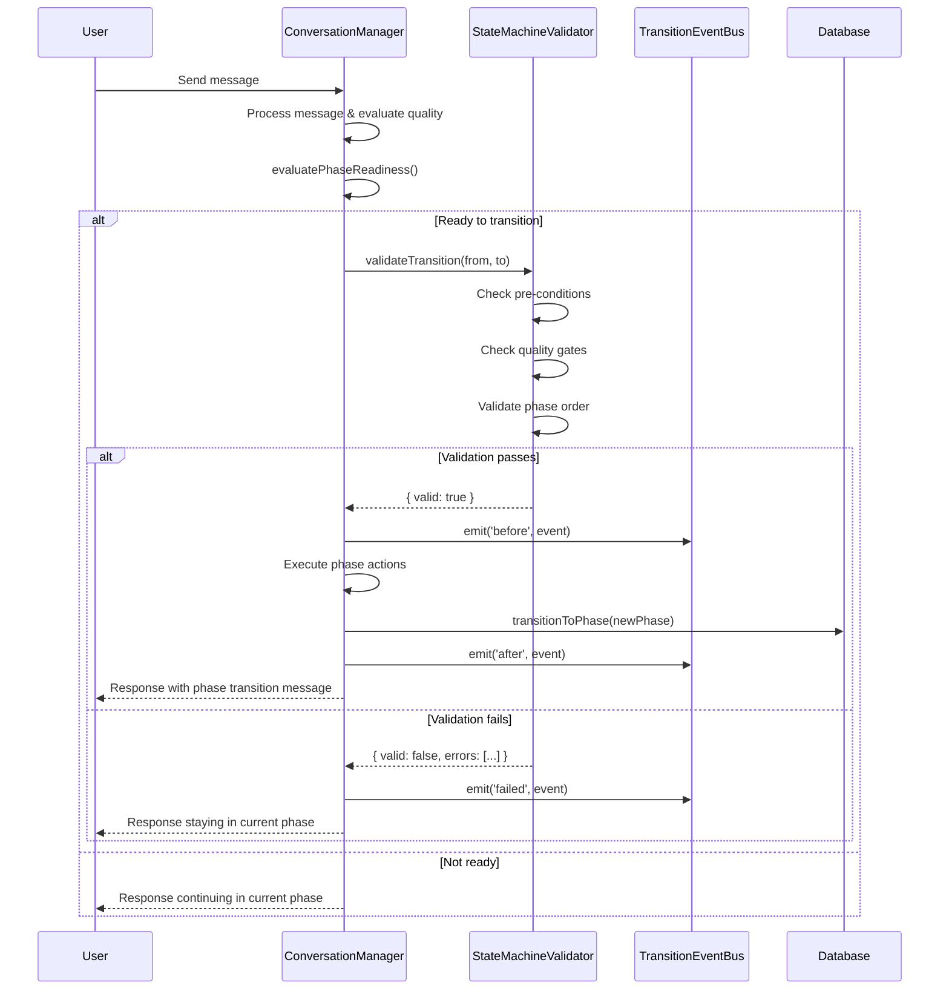

# OKR Conversation State Machine

## Overview

The OKR conversation state machine guides users through a structured 5-phase workflow to create high-quality OKRs (Objectives and Key Results). The system ensures forward-only progression with quality gates and validation at each transition.

## Flow Diagram



## Phase Details

### Phase 1: Discovery

**Purpose**: Understand business context and capture initial objective

**Entry Requirements**:
- Session created
- User sends first message
- No prior phase exists

**Activities**:
- Ask clarifying questions about business context
- Identify stakeholders and timeframe
- Extract initial objective draft
- Assess business impact and outcomes

**Exit Requirements** (ALL must be true OR explicit approval):
- ✅ Objective draft identified in session context
- ✅ Objective quality score ≥ 30/100
- ✅ Minimum 3 conversation turns
- ✅ Readiness score > 0.6
- **OR** user explicitly approves AND objective data exists

**Quality Validation**:
```typescript
{
  hasObjectiveData: qualityScores.objective.overall > 30,
  hasMinimumContext: messageCount >= 3,
  hasAcceptableQuality: readinessScore > 0.6
}
```

**Timeout Protection**: Force transition after 12 messages (prevents infinite loops)

**Common Issues**:
- User provides vague objective → Ask for specificity
- Missing business context → Probe for stakeholders/impact
- Quality too low → Guide toward outcome focus

---

### Phase 2: Refinement

**Purpose**: Improve objective clarity, quality, and outcome focus

**Entry Requirements**:
- Completed discovery phase
- Objective extracted and stored in `session.context.okrData.objective`
- Objective quality score > 0 (has been evaluated)

**Activities**:
- Refine objective language for clarity
- Ensure outcome-oriented (not task-oriented)
- Verify measurability and timeframe
- Improve specificity and ambition

**Exit Requirements** (ALL must be true OR explicit approval):
- ✅ Objective quality score ≥ 60/100 (good quality)
- ✅ Minimum 2 conversation turns in refinement
- ✅ Readiness score > 0.7
- **OR** user explicitly approves AND quality ≥ 60/100

**Quality Validation**:
```typescript
{
  objectiveQuality: qualityScores.objective.overall >= 60,
  hasMinRefinementMessages: messageCount >= 2,
  meetsQualityBar: true
}
```

**Timeout Protection**: Force transition after 10 messages

**Common Issues**:
- Task-oriented objective → Reframe as outcome
- Too generic → Add specificity
- Not ambitious enough → Encourage stretch goals

---

### Phase 3: KR Discovery

**Purpose**: Create 2-4 measurable key results that track objective progress

**Entry Requirements**:
- Completed refinement phase
- Objective quality ≥ 60/100 (from refinement)
- Refined objective stored in context

**Activities**:
- Brainstorm key metrics and milestones
- Ensure measurability (quantitative preferred)
- Verify key results track objective achievement
- Aim for 2-4 key results (optimal range)

**Exit Requirements** (ANY can trigger):
- ✅ ≥2 key results created with average quality ≥ 50/100
- ✅ Minimum 3 conversation turns
- ✅ Key results stored in `session.context.okrData.keyResults`
- **OR** timeout after 8 messages (with ≥1 KR)
- **OR** user explicitly approves with key results present

**Quality Validation**:
```typescript
{
  krCount: qualityScores.keyResults.length >= 2,
  avgKRQuality: (sum of KR scores / count) >= 50,
  hasStoredKRs: session.context.okrData.keyResults.length > 0
}
```

**Timeout Protection**: Force transition after 8 messages (more lenient due to complexity)

**Common Issues**:
- Vague key results → Push for specific metrics
- Too many KRs (>5) → Help prioritize most impactful
- Not measurable → Guide toward quantitative metrics

---

### Phase 4: Validation

**Purpose**: Final quality check and user approval of complete OKR set

**Entry Requirements**:
- Completed KR discovery phase
- ≥1 key result created and stored
- Key results have quality scores

**Activities**:
- Review complete OKR set
- Check alignment between objective and key results
- Verify measurability and clarity
- Obtain final user approval

**Exit Requirements** (ALL must be true):
- ✅ Complete OKR set exists (objective + key results)
- ✅ Overall quality score ≥ 40/100 (minimum acceptable)
- ✅ User explicitly approves ("looks good", "approved", "finalize")
- ✅ Minimum 1 conversation turn (confirmation)

**Quality Validation**:
```typescript
{
  hasCompleteOKR: session.context.okrData.objective && session.context.okrData.keyResults.length > 0,
  overallQuality: qualityScores.overall.score >= 40,
  userApproval: finalizationSignalDetected === true
}
```

**Timeout Protection**: Force transition after 12 messages (allow for refinement discussions)

**Common Issues**:
- User wants changes → Allow edits and re-validate
- Quality concerns → Suggest improvements before finalizing
- Alignment issues → Highlight KRs not tracking objective

---

### Phase 5: Completed

**Purpose**: OKR finalized and permanently stored

**Entry Requirements**:
- Completed validation phase
- User approval obtained
- Complete OKR set with acceptable quality

**Activities**:
- Store OKR in database (`okr_sets` and `key_results` tables)
- Generate export formats (JSON, Markdown)
- Provide summary and next steps

**Exit Requirements**:
- ❌ **NONE - Terminal state**
- No transitions allowed from completed phase

**Quality Validation**:
```typescript
{
  isFinal: true,
  cannotTransition: true,
  okrStored: true
}
```

**Timeout Protection**: N/A (terminal state)

---

## State Transition Rules

### Rule 1: Forward-Only Progression
**Implementation**: `StateMachineValidator.validateTransition()`

```typescript
// Transitions can only move forward in phase sequence
const phaseOrder = ['discovery', 'refinement', 'kr_discovery', 'validation', 'completed'];
const fromIndex = phaseOrder.indexOf(fromPhase);
const toIndex = phaseOrder.indexOf(toPhase);

if (toIndex <= fromIndex) {
  throw new Error('Backward transitions not allowed');
}
```

**Exception**: `completed` phase is terminal and never transitions

---

### Rule 2: Quality Gates
**Implementation**: `StateMachineValidator.validateQualityRequirements()`

Each phase has minimum quality requirements:

| Transition | Quality Gate |
|------------|--------------|
| discovery → refinement | Objective quality ≥ 30/100 |
| refinement → kr_discovery | Objective quality ≥ 60/100 |
| kr_discovery → validation | Average KR quality ≥ 50/100 |
| validation → completed | Overall quality ≥ 40/100 |

**Override**: User can explicitly approve if quality threshold met

---

### Rule 3: Data Pre-conditions
**Implementation**: `StateMachineValidator.validatePreConditions()`

Each phase requires specific data to exist:

| Phase | Required Data |
|-------|---------------|
| discovery | `okrData.objective` (draft) |
| refinement | `okrData.objective` (with score > 0) |
| kr_discovery | `okrData.objective` (quality ≥ 60) |
| validation | `okrData.objective` + `okrData.keyResults` (≥1 KR) |
| completed | `okrData.objective` + `okrData.keyResults` (≥1 KR) |

---

### Rule 4: Timeout Protection
**Implementation**: `evaluatePhaseReadiness()` + turn counter

Prevents infinite loops by forcing progression:

| Phase | Timeout (messages) | Behavior |
|-------|-------------------|----------|
| discovery | 12 | Force to refinement if objective exists |
| refinement | 10 | Force to kr_discovery if quality ≥ 50 |
| kr_discovery | 8 | Force to validation if ≥1 KR exists |
| validation | 12 | Force to completed if OKR set exists |
| completed | N/A | Terminal state |

---

## User Approval Detection

**Implementation**: `detectFinalizationInConversation()`

### Strong Signals (High Confidence)
Explicit phrases that trigger immediate transition consideration:
- "let's finalize", "finalize this", "ready to finalize"
- "i approve", "approved", "looks perfect"
- "we're done", "final okr", "wrap this up"
- "let's move forward", "move to next phase"

### Approval Signals (Medium Confidence)
Context-aware phrases (require late phase):
- "looks good", "sounds good", "that works"
- "i like it", "perfect", "excellent"
- "that's great", "exactly what i wanted"

**Context Rules**:
- Approval signals only trigger after 5+ messages (prevents early false positives)
- Requires ≥2 approval phrases OR 1 strong signal
- Must have required data for current phase

---

## Transition Event Flow



---

## Example Conversation Flows

### Happy Path (Optimal Flow)

```
Turn 1: [discovery]
User: "I want to improve customer satisfaction"
System: "Great start! Who are the stakeholders? What's the current state?"

Turn 2: [discovery]
User: "Our customer success team. Current NPS is 45, want to reach 65"
System: "Excellent context. Let me capture: 'Increase customer satisfaction from NPS 45 to 65'"

Turn 3: [discovery → refinement]
User: "Yes, that's right"
System: "Moving to refinement. Let's make this more outcome-focused..."

Turn 4-5: [refinement → kr_discovery]
[Objective refined to high quality]
System: "Great! Let's create key results..."

Turn 6-8: [kr_discovery → validation]
[3 key results created]
System: "Here's your complete OKR..."

Turn 9: [validation → completed]
User: "Looks perfect, approved"
System: "Finalized! OKR saved to database."
```

**Total turns**: 9 messages (highly efficient)

---

### Stuck Discovery (Timeout Flow)

```
Turn 1-10: [discovery]
User: Provides vague, task-oriented objectives repeatedly
System: Continues asking clarifying questions

Turn 11: [discovery]
System: "I notice we've been in discovery for a while. Let me capture what we have..."

Turn 12: [discovery → refinement] FORCED
System: "I'm moving us to refinement with what we have: '[captured objective]'"
```

**Timeout triggered**: 12 messages in discovery
**Reason**: Prevents infinite loops when user struggles with initial objective

---

### Premature Finalization Attempt (Quality Gate Block)

```
Turn 1-2: [discovery]
User: "I want to do better marketing"
System: "Can you be more specific..."

Turn 3: [discovery]
User: "That's fine, let's finalize"
System detects finalization signal BUT:
  - Objective quality: 15/100 (too low)
  - Required minimum: 30/100
  - Block transition, stay in discovery

System: "I'd like to refine this a bit more. What specific marketing outcomes are you targeting?"
```

**Quality gate prevented premature transition**

---

## Analytics & Monitoring

### Key Metrics to Track

**Transition Health**:
- `premature_transitions`: Transitions with quality < minimum threshold
- `forced_transitions`: Transitions triggered by timeout
- `blocked_transitions`: Validation failures preventing transition
- `user_approval_transitions`: Transitions with explicit approval

**Phase Efficiency**:
- `avg_messages_per_phase`: Average turns spent in each phase
- `phase_completion_rate`: % of sessions completing each phase
- `phase_quality_delta`: Quality improvement during phase

**Overall Flow**:
- `completion_rate`: % of sessions reaching completed phase
- `avg_time_to_complete`: Average session duration
- `final_quality_distribution`: Histogram of completed OKR scores

---

## Validation Matrix

| Transition | Pre-conditions | Quality Requirements | Can Force? |
|------------|----------------|---------------------|------------|
| start → discovery | Session created | None | N/A |
| discovery → refinement | Objective extracted, score > 0 | Objective ≥ 30/100 | Yes (12 msgs) |
| refinement → kr_discovery | Objective in context | Objective ≥ 60/100 | Yes (10 msgs) |
| kr_discovery → validation | ≥1 KR stored | Avg KR ≥ 50/100 | Yes (8 msgs) |
| validation → completed | Complete OKR + approval | Overall ≥ 40/100 | Yes (12 msgs) |
| completed → * | N/A | N/A | ❌ Never |

---

## Error Recovery

### Scenario 1: Transition Validation Fails Mid-Flight
**Problem**: Database update succeeds but analytics logging fails

**Solution**: Transaction-like behavior
```typescript
try {
  const validation = StateMachineValidator.validateTransition(...);
  if (!validation.valid) {
    // Don't start transition
    return;
  }

  await this.transitionToPhase(newPhase);
  await this.db.logAnalyticsEvent(...);
} catch (error) {
  // Rollback transition if analytics fails
  await this.transitionToPhase(originalPhase);
  logger.error('Transition rollback', error);
}
```

---

### Scenario 2: User Provides Complete OKR Early
**Problem**: User sends "Objective: X, KRs: A, B, C" in first message

**Current Behavior**: Process through all phases (slower)

**Future Enhancement**: Parallel state tracking
```typescript
{
  conversationPhase: 'discovery',  // Where dialogue is
  dataPhase: 'validation',         // Quality of data
  suggestSkip: true                // Offer to jump ahead
}
```

---

## Testing Strategy

### Unit Tests
```typescript
describe('StateMachineValidator', () => {
  describe('validateTransition', () => {
    it('should allow discovery → refinement with valid data');
    it('should block refinement → kr_discovery with quality < 60');
    it('should block backward transitions');
    it('should allow completed phase entry with approval');
  });

  describe('validatePreConditions', () => {
    it('should require objective for refinement entry');
    it('should require key results for validation entry');
  });

  describe('validateQualityRequirements', () => {
    it('should enforce minimum quality thresholds');
    it('should allow user override with approval');
  });
});
```

### Integration Tests
```typescript
describe('End-to-End Conversation Flow', () => {
  it('should complete happy path in 9-12 messages');
  it('should force progression after timeout');
  it('should prevent premature transitions');
  it('should respect quality gates');
  it('should handle user approval correctly');
});
```

---

## References

**Implementation Files**:
- Phase configuration: `src/config/stateMachine.ts`
- Validation logic: `src/services/StateMachineValidator.ts`
- Transition orchestration: `src/services/ConversationManager.ts` (lines 545-630)
- Quality evaluation: `src/services/ConversationManager.ts` (lines 1617-1804)

**Type Definitions**:
- `ConversationPhase`: `src/types/database.ts:34`
- `PhaseConfig`: `src/config/stateMachine.ts:23`
- `ValidationResult`: `src/services/StateMachineValidator.ts:11`

---

## Changelog

**v2.0 (Current)**:
- ✅ Added centralized StateMachineValidator
- ✅ Implemented quality gates for all transitions
- ✅ Improved finalization detection with approval signals
- ✅ Extracted phase configuration to central config

**v1.0 (Initial)**:
- Basic 5-phase state machine
- Forward-only progression
- Timeout protection
- Phase readiness evaluation
